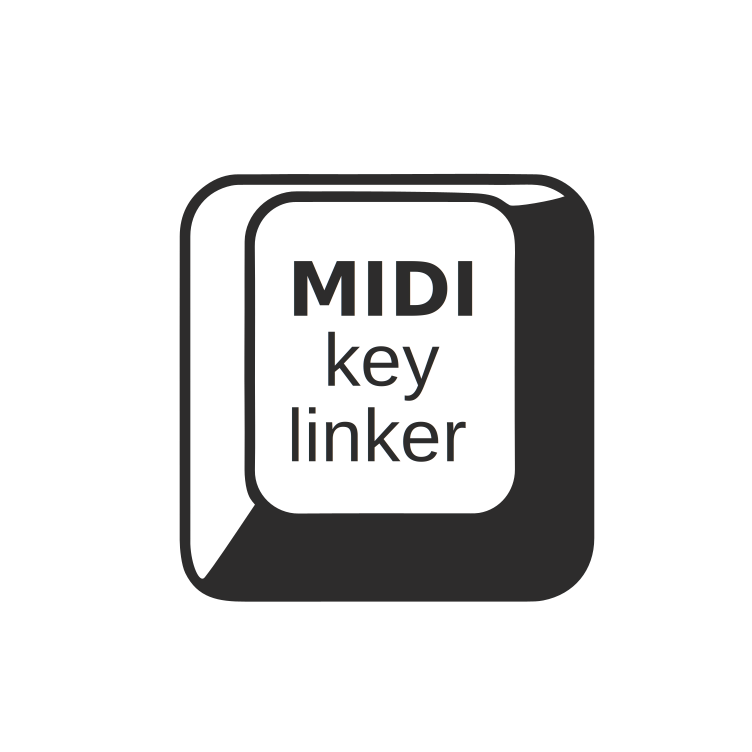
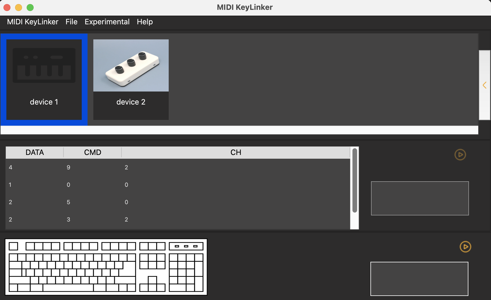

<a name="readme-top"></a>
 


<!-- PROJECT SHIELDS -->
<!--
*** I'm using markdown "reference style" links for readability.
*** Reference links are enclosed in brackets [ ] instead of parentheses ( ).
*** See the bottom of this document for the declaration of the reference variables
*** for contributors-url, forks-url, etc. This is an optional, concise syntax you may use.
*** https://www.markdownguide.org/basic-syntax/#reference-style-links
-->
 
[![Forks][forks-shield]][forks-url]
[![Stargazers][stars-shield]][stars-url]
[![Issues][issues-shield]][issues-url]
[![MIT License][license-shield]][license-url]
 


<!-- PROJECT LOGO -->
<br />
<div>
  <a href="https://github.com/andresjpulido/MIDIKeyLinker">
    
  </a>

  <h3 >MIDI KeyLinker</h3>

  <p >
    With MIDI keyLinker, you can easily assign MIDI messages from your MIDI controller or device to specific keyboard shortcuts or mouse commands within your favourite software applications.
    <br />
        <br />
    <br />
    <a href="https://github.com/andresjpulido/MIDIKeyLinker">View Demo</a>
    ·
    <a href="https://github.com/andresjpulido/MIDIKeyLinker/issues/new?labels=bug&template=bug-report---.md">Report Bug</a>
    ·
    <a href="https://github.com/andresjpulido/MIDIKeyLinker/issues/new?labels=enhancement&template=feature-request---.md">Request Feature</a>
  </p>
</div>


<!-- TABLE OF CONTENTS -->
<details>
  <summary>Table of Contents</summary>
  <ol>
    <li>
      <a href="#about-the-project">About The Project</a>
      <ul>
        <li><a href="#built-with">Built With</a></li>
      </ul>
    </li>
    <li>
      <a href="#getting-started">Getting Started</a>
      <ul>
        <li><a href="#prerequisites">Prerequisites</a></li>
        <li><a href="#installation">Installation</a></li>
      </ul>
    </li>
    <li><a href="#usage">Usage</a></li>
    <li><a href="#roadmap">Roadmap</a></li>
    <li><a href="#contributing">Contributing</a></li>
    <li><a href="#license">License</a></li>
    <li><a href="#contact">Contact</a></li>
    <li><a href="#acknowledgments">Acknowledgments</a></li>
  </ol>
</details>


<!-- ABOUT THE PROJECT -->
## About The Project
 
 <p align="center">

</p>

This software allows you to map midi messages to keyboard commands, connect your midi controller to your computer, play a control and customize a command on your keyboard. 

<p align="right">(<a href="#readme-top">back to top</a>)</p>


### Built With

This section should list any major frameworks/libraries used to bootstrap your project. Leave any add-ons/plugins for the acknowledgements section. Here are a few examples.

* [![python][python]][python-url]
* [![pyqt6][pyqt6]][pyqt6-url] 
* [![rtmidi][rtmidi]][rtmidi-url]
* [![pyqt6-tools][pyqt6-tools]][pyqt6-tools-url]

<p align="right">(<a href="#readme-top">back to top</a>)</p>


<!-- GETTING STARTED -->
## Getting Started

Currently we have not released any releases, which is why it is required to run the desktop application from its source code. Below I show you the necessary steps to run it on your computer, initially you have to download the source code from our github repository:

```sh
git clone https://github.com/andresjpulido/MIDIKeyLinker.git
```

### Prerequisites

Below is the list of libraries required to compile this application.
 
  ```sh
  pip install -r requirements.txt
  ```

### Execution

```sh 
python app.py
```

### Development

_The user interface has been created using the QT Designer tool, below I show how to customize the UI and translate it to Python code. ._

Open the Qt Designer:

```sh 
pyqt6-tools designer
```

This command generates a Python module according to the given options:
 
```sh 
pyuic6 main.ui -o main.py
```
  
<p align="right">(<a href="#readme-top">back to top</a>)</p>


<!-- USAGE EXAMPLES -->
## Usage

We have created a wiki to document the use of this application. Additional screenshots, code examples and demos work well in this space. You may also link to more resources.

_Please refer to the [Documentation](https://github.com/andresjpulido/MIDIKeyLinker/wiki)_

<p align="right">(<a href="#readme-top">back to top</a>)</p>


<!-- ROADMAP -->
## Roadmap

- [x] Add reading file preferences
- [ ] MIDI Device Recognition
- [ ] Identification of MIDI messages
- [ ] MIDI command mapping
- [ ] Multi-language Support
    - [ ] Spanish

See the [open issues](https://github.com/andresjpulido/MIDIKeyLinker/issues) for a full list of proposed features (and known issues).

<p align="right">(<a href="#readme-top">back to top</a>)</p>


<!-- CONTRIBUTING -->
## Contributing

Contributions are what make the open source community such an amazing place to learn, inspire, and create. Any contributions you make are **greatly appreciated**.

If you have a suggestion that would make this better, please fork the repo and create a pull request. You can also simply open an issue with the tag "enhancement".
Don't forget to give the project a star! Thanks again!

1. Fork the Project
2. Create your Feature Branch (`git checkout -b feature/AmazingFeature`)
3. Commit your Changes (`git commit -m 'Add some AmazingFeature'`)
4. Push to the Branch (`git push origin feature/AmazingFeature`)
5. Open a Pull Request

<p align="right">(<a href="#readme-top">back to top</a>)</p>


<!-- LICENSE -->
## License

Distributed under the MIT License. See [`LICENSE`](https://github.com/andresjpulido/MIDIKeyLinker/blob/main/LICENSE) for more information.

<p align="right">(<a href="#readme-top">back to top</a>)</p>


<!-- CONTACT -->
## Contact

Andres - [@andresjpb](https://twitter.com/andresjpb) - andresjpulido@gmail.com

Project Link: [https://github.com/andresjpulido/MIDIKeyLinker](https://github.com/andresjpulido/MIDIKeyLinker)

<p align="right">(<a href="#readme-top">back to top</a>)</p>


<!-- ACKNOWLEDGMENTS -->
## Acknowledgments

This list contains some useful resources for working on this project.

* [MIDI Association](https://midi.org)

<p align="right">(<a href="#readme-top">back to top</a>)</p>


<!-- MARKDOWN LINKS & IMAGES -->
<!-- https://www.markdownguide.org/basic-syntax/#reference-style-links -->
 [forks-shield]: https://img.shields.io/github/forks/andresjpulido/MIDIKeyLinker?style=for-the-badge
[forks-url]: https://github.com/andresjpulido/MIDIKeyLinker/network/members
[stars-shield]: https://img.shields.io/github/stars/andresjpulido%2FMIDIKeyLinker?style=for-the-badge
[stars-url]: https://github.com/andresjpulido/MIDIKeyLinker/stargazers
[issues-shield]: https://img.shields.io/github/issues/andresjpulido/MIDIKeyLinker?style=for-the-badge
[issues-url]: https://github.com/andresjpulido/MIDIKeyLinker/issues
[license-shield]: https://img.shields.io/github/license/andresjpulido/MIDIKeyLinker?style=for-the-badge
[license-url]: https://github.com/andresjpulido/MIDIKeyLinker/blob/main/LICENSE
[product-screenshot]: docs/images/screenshot01.png


[python]: https://img.shields.io/badge/python-606060?style=for-the-badge&logoColor=fff&labelColor=fff
[python-url]: https://www.python.org/
[rtmidi]: https://img.shields.io/badge/rtmidi-2E6CA8?style=for-the-badge&logoColor=fff&labelColor=fff
[rtmidi-url]: https://pypi.org/project/python-rtmidi/
[pyqt6-tools]: https://img.shields.io/badge/pyqt6%20tools-2E6CA8?style=for-the-badge&logoColor=fff&labelColor=fff
[pyqt6-tools-url]: https://pypi.org/project/pyqt6-tools/
[pyqt6]: https://img.shields.io/badge/pyqt6-2E6CA8?style=for-the-badge&logoColor=fff&labelColor=fff
[pyqt6-url]: https://pypi.org/project/PyQt6/ 
 